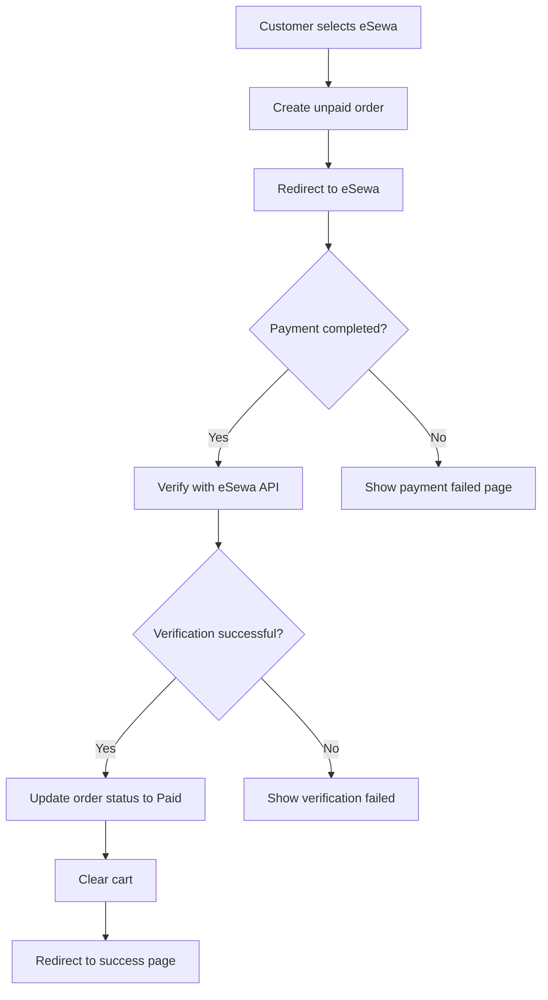

# Inventory Management System

This is a comprehensive inventory management system built with Next.js, MongoDB, and TypeScript.

## Features

- Product management with variants and sizes
- Shopping cart functionality
- Order processing
- User authentication
- Admin dashboard

## Recent Updates

### eSewa Payment Integration

We've integrated eSewa payment gateway into the checkout process. Here's how it works:

1. Customer selects eSewa as payment method during checkout
2. Order is created with "Unpaid" status
3. Customer is redirected to eSewa payment page
4. After payment, eSewa redirects back to our site
5. Payment is verified with eSewa servers
6. Order status is updated to "Paid" and "Processing"
7. Customer is redirected to order success page

#### Flow Diagram



#### Environment Variables

To use eSewa integration, you need to set these environment variables:

```
NEXT_PUBLIC_ESEWA_PAYMENT_URL=https://uat.esewa.com.np/epay/main
NEXT_PUBLIC_ESEWA_MERCHANT_ID=YOUR_MERCHANT_ID
ESEWA_VERIFY_URL=https://uat.esewa.com.np/epay/transrec
ESEWA_MERCHANT_ID=YOUR_MERCHANT_ID
```

For production, replace the URLs with live eSewa endpoints.

## Installation

1. Clone the repository
2. Install dependencies: `npm install`
3. Set up environment variables
4. Run the development server: `npm run dev`

## Contributing

Contributions are welcome! Please fork the repository and submit a pull request.